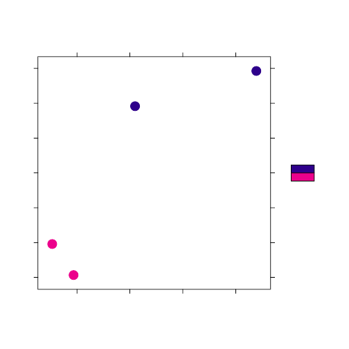
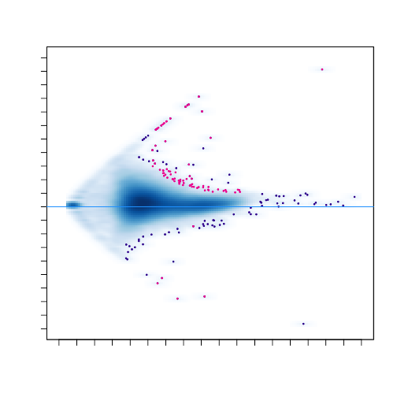

# Statistical Analysis of Differentially Open Chromatin Sites


## Introduction

ATAC-seq (Assay for Transposase-Accessible Chromatin using Sequencing) is a genomic assay that reveals open chromatin sites in the genome using the Tn5 transposase. As with any Omics assay, ATAC-seq can be used to elucidate genomic differences between two conditions. In this vignette, we will use the DiffBind R package to statistically model and test differences in open chromatin sites between iPSC derived motor neurons from two ALS and two healthy patients. 

For more information on the DiffBind package:

[User guide](https://bioconductor.org/packages/release/bioc/vignettes/DiffBind/inst/doc/DiffBind.pdf)

[Reference manual](https://bioconductor.org/packages/release/bioc/manuals/DiffBind/man/DiffBind.pdf)

## 1. Load peaks and counts

We will first load the DiffBind package. 


```r
library(DiffBind)
```

In order to load our data, need to provide diffbind's `dba()` function with a samplesheet containing information about each sample (name, condition, replicate...etc), the locations of the peak files (bed format), and the locations of the bam files containing the aligned reads. The samplesheet can be a dataframe or a csv file. In this example, we will use a csv file. The result of the call to `dba()` is a DBA object.  


```r
samples=dba(sampleSheet="sample_sheet_diffBind_rmdtest.csv")
```

```
## 25iCTR d32_diMNS CTR   1 macs
```

```
## 83iCTR d32_diMNS CTR   2 macs
```

```
## 30iALS d32_diMNS ALS   1 macs
```

```
## 52iALS d32_diMNS ALS   2 macs
```

```r
samples
```

```
## 4 Samples, 55674 sites in matrix (113333 total):
##       ID    Tissue Factor Replicate Caller Intervals
## 1 25iCTR d32_diMNS    CTR         1   macs     56203
## 2 83iCTR d32_diMNS    CTR         2   macs     63962
## 3 30iALS d32_diMNS    ALS         1   macs     81044
## 4 52iALS d32_diMNS    ALS         2   macs     64528
```

Each sample has an ID (name), Tissue, Factor, Condition, Treatment, and peak caller field. It is recommended to put as much relevant information into the samplesheet as possible. The Intervals field shows the number of peaks for each sample while the FRiP shows the fraction of reads in peaks. 

We will then create a unified set of genomic intervals (or peaks) for all samples and assign a score to each interval by using `dba.count()`. This funtion will merge overlapping intervals together. By default, it will remove any intervals that are not present in at least two samples (this can be adjusted by the `minOverlap` option). It will then count the number of reads under the intervals for each sample and assign that as a score. Note that this score is for visualization purposes only. Downstream analyses will use a different normalized read score. 


```r
samples_count = dba.count(samples,score=DBA_SCORE_READS, minOverlap=2)
samples_count
```

```
## 4 Samples, 55674 sites in matrix:
##       ID    Tissue Factor Replicate Caller Intervals FRiP
## 1 25iCTR d32_diMNS    CTR         1 counts     55674 0.26
## 2 83iCTR d32_diMNS    CTR         2 counts     55674 0.18
## 3 30iALS d32_diMNS    ALS         1 counts     55674 0.26
## 4 52iALS d32_diMNS    ALS         2 counts     55674 0.27
```

```r
head(samples_count$binding)
```

```
##   CHR  START    END 25iCTR 83iCTR 30iALS 52iALS
## 1   1  10661  10772      1      1      1      1
## 2   1  10864  11030      1      1      1      1
## 3   1  11182  11398      1      1      1      1
## 4   1  28718  29879      1      1      1      1
## 5   1  55989  56424      2      1      1      1
## 6   1 163237 163473      1      1      1      1
```

## 2. Plotting raw count data

Next we will make a heatmap and a PCA plot to evaluate our data. `dba.plotHeatmap()` will take a DBA object and create a heatmap using pearson correlation. `dba.plotPCA()` will take a DBA object and an attribute value `(DBA_FACTOR and DBA_ID)` for coloring and labeling samples.


```r
dba.plotHeatmap(samples_count)
```


```r
dba.plotPCA(samples_count,DBA_FACTOR,label=DBA_ID)
```




## 3. Setting up contrasts and performing DEseq2 analysis

Before performing differential analysis, we need to tell diffbind which groups to compare. `dba.contrast()` will set up a contrast between groups using an attribute value. We will use `DBA_FACTOR` since we want to compare control groups vs ALS groups in this example. The option `minMembers` determines the minimum number of samples or replicates a condition must have in order to be considered for the differential analysis. It is recommneded to have at least two replicates but the option can be changed if replicates are not available. 


```r
als = dba.mask(samples_count, DBA_FACTOR, "ALS")
ctr = dba.mask(samples_count, DBA_FACTOR, "CTR")
samples_contrast = dba.contrast(samples_count, als, ctr, "als", "ctr")
samples_contrast
```

```
## 4 Samples, 55674 sites in matrix:
##       ID    Tissue Factor Replicate Caller Intervals FRiP
## 1 25iCTR d32_diMNS    CTR         1 counts     55674 0.26
## 2 83iCTR d32_diMNS    CTR         2 counts     55674 0.18
## 3 30iALS d32_diMNS    ALS         1 counts     55674 0.26
## 4 52iALS d32_diMNS    ALS         2 counts     55674 0.27
## 
## 1 Contrast:
##   Group1 Members1 Group2 Members2
## 1    als        2    ctr        2
```


Next, we will call `dba.analyze()` to perform the differential analysis between the contrasts we set. We will set the method for differential analysis as `DBA_DESEQ2` and set `bFullLibrarySize=TRUE` in order to use the total number of reads as the library size.


```r
samples_differential = dba.analyze(samples_contrast, method = DBA_DESEQ2, bFullLibrarySize = TRUE)
```

```
## converting counts to integer mode
```

```
## gene-wise dispersion estimates
```

```
## mean-dispersion relationship
```

```
## final dispersion estimates
```

```r
samples_differential
```

```
## 4 Samples, 55674 sites in matrix:
##       ID    Tissue Factor Replicate Caller Intervals FRiP
## 1 25iCTR d32_diMNS    CTR         1 counts     55674 0.26
## 2 83iCTR d32_diMNS    CTR         2 counts     55674 0.18
## 3 30iALS d32_diMNS    ALS         1 counts     55674 0.26
## 4 52iALS d32_diMNS    ALS         2 counts     55674 0.27
## 
## 1 Contrast:
##   Group1 Members1 Group2 Members2 DB.DESeq2
## 1    als        2    ctr        2        80
```

We see that there are 80 differential peaks between Control and ALS samples with an FDR below .05.

In order to visualize the effect of normalization on our dataset, we will make an MA plot using `dba.plotMA()`. If the slope of the line going through the points is 0, then the normalization is effective. The pink and blue highlighted dots indicate the differential peaks. 


```r
dba.plotMA(samples_differential)
```



Finally, we will create a DBA report and write out peaks under an FDR of .1 to a bed file for use in other analyses.


```r
samples_differential.DB = dba.report(samples_differential, method=DBA_DESEQ2, th=.1,  bUsePval=F ,  bDB=T, bAll=T)
samples_differential.DB
```

```
## 1 Samples, 133 sites in matrix:
##           ID Tissue Factor Condition Treatment Replicate Caller Intervals
## 1 als_vs_ctr    All     DB    DESeq2                                  133
```

```r
head(as.data.frame(samples_differential.DB$peaks))
```

```
##        Chr     Start       End abs.rep.Fold.
## 2928  chr1 144533545 144534519          1.46
## 4206  chr1 198906460 198906842          1.70
## 5404 chr10   2673924   2674625          1.56
## 5416 chr10   3239639   3239876          1.73
## 5435 chr10   4891792   4892187          1.58
## 5548 chr10  13628733  13629070          1.48
```

```r
write.table(samples_differential.DB$peaks, file = "ALS_vs_CTR_diff_peaks.bed", quote=F, sep="\t", row.names=F, col.names=F)
```

## 4. Session Info:


```r
sessionInfo()
```

```
## R version 3.3.0 (2016-05-03)
## Platform: x86_64-pc-linux-gnu (64-bit)
## 
## locale:
##  [1] LC_CTYPE=en_US.UTF-8       LC_NUMERIC=C              
##  [3] LC_TIME=en_US.UTF-8        LC_COLLATE=en_US.UTF-8    
##  [5] LC_MONETARY=en_US.UTF-8    LC_MESSAGES=en_US.UTF-8   
##  [7] LC_PAPER=en_US.UTF-8       LC_NAME=C                 
##  [9] LC_ADDRESS=C               LC_TELEPHONE=C            
## [11] LC_MEASUREMENT=en_US.UTF-8 LC_IDENTIFICATION=C       
## 
## attached base packages:
## [1] stats4    parallel  stats     graphics  grDevices utils     datasets 
## [8] methods   base     
## 
## other attached packages:
##  [1] DiffBind_2.0.9             SummarizedExperiment_1.2.3
##  [3] Biobase_2.32.0             GenomicRanges_1.24.3      
##  [5] GenomeInfoDb_1.8.7         IRanges_2.6.1             
##  [7] S4Vectors_0.10.3           BiocGenerics_0.18.0       
##  [9] markdown_0.7.7             knitr_1.15.1              
## 
## loaded via a namespace (and not attached):
##  [1] Category_2.38.0         bitops_1.0-6           
##  [3] RColorBrewer_1.1-2      tools_3.3.0            
##  [5] backports_1.0.4         R6_2.2.0               
##  [7] rpart_4.1-10            KernSmooth_2.23-15     
##  [9] Hmisc_4.0-2             DBI_0.5-1              
## [11] lazyeval_0.2.0          colorspace_1.3-2       
## [13] nnet_7.3-12             gridExtra_2.2.1        
## [15] DESeq2_1.12.4           sendmailR_1.2-1        
## [17] graph_1.50.0            htmlTable_1.8          
## [19] rtracklayer_1.32.2      caTools_1.17.1         
## [21] scales_0.4.1            checkmate_1.8.2        
## [23] BatchJobs_1.6           genefilter_1.54.2      
## [25] RBGL_1.48.1             stringr_1.1.0          
## [27] digest_0.6.11           Rsamtools_1.24.0       
## [29] foreign_0.8-67          AnnotationForge_1.14.2 
## [31] XVector_0.12.1          base64enc_0.1-3        
## [33] htmltools_0.3.5         limma_3.28.21          
## [35] highr_0.6               RSQLite_1.0.0          
## [37] BBmisc_1.10             GOstats_2.38.1         
## [39] hwriter_1.3.2           BiocParallel_1.6.6     
## [41] gtools_3.5.0            acepack_1.4.1          
## [43] dplyr_0.5.0             RCurl_1.95-4.8         
## [45] magrittr_1.5            GO.db_3.3.0            
## [47] Formula_1.2-1           Matrix_1.2-7.1         
## [49] Rcpp_0.12.8             munsell_0.4.3          
## [51] stringi_1.1.2           edgeR_3.14.0           
## [53] zlibbioc_1.18.0         gplots_3.0.1           
## [55] fail_1.3                plyr_1.8.4             
## [57] grid_3.3.0              gdata_2.17.0           
## [59] lattice_0.20-34         Biostrings_2.40.2      
## [61] splines_3.3.0           GenomicFeatures_1.24.5 
## [63] annotate_1.50.1         locfit_1.5-9.1         
## [65] rjson_0.2.15            systemPipeR_1.6.4      
## [67] geneplotter_1.50.0      biomaRt_2.28.0         
## [69] XML_3.98-1.5            evaluate_0.10          
## [71] ShortRead_1.30.0        latticeExtra_0.6-28    
## [73] data.table_1.10.0       gtable_0.2.0           
## [75] amap_0.8-14             assertthat_0.1         
## [77] ggplot2_2.2.1           mime_0.5               
## [79] xtable_1.8-2            survival_2.40-1        
## [81] tibble_1.2              pheatmap_1.0.8         
## [83] GenomicAlignments_1.8.4 AnnotationDbi_1.34.4   
## [85] cluster_2.0.5           brew_1.0-6             
## [87] GSEABase_1.34.1
```

